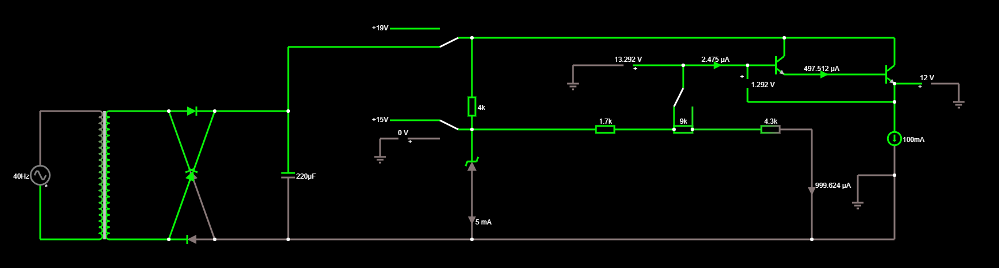

# Fonte 3-12V
 Circuito de uma fonte de 100mA de 3 a 12 volts
 Para executar o código com os cálculos dos valores finais obtidos (listados abaixo), execute:
 
    python script.py

[Circuito Ideal](http://tinyurl.com/yblvf7et)

[Circuito Real](http://tinyurl.com/ybcebmec)

Valores pré-determinados:
- Tensão máxima e mínima: 12v e 3v
- Queda de tensão entre a base do primeiro transistor e o emissor do último: 1.292V (medido no falstad, muda levemente para correntes diferentes)
- Resistência do resistor à direita do potenciômetro: 4k3 (explicação abaixo)
- Ganho dos transistores: 200 (explicação abaixo)
- Corrente máxima na base do transistor: 2.475 uA (medido no falstad)
- Tensão mínima garantida pelo capacitor: 19v (o mesmo teve sua capacitância escolhida de modo a garantir esse valor)
- Tensão de quebra do diodo zener: 15v (explicação abaixo)

Valores calculados a partir dos definidos acima:
- Resistência máxima do potenciômetro: calculada em 8997.001013056068
- Resistência do resistor à esquerda do potenciômetro (entre o mesmo e o diodo zener): calculada em 1704.4225888350963
- Resistência acima do diodo zener: calculada em 3991.6219879041864

# Preços dos Componentes
OBS: Preços atualizados em 20/06/2020
## Resistor à direita do potenciômetro
- 1 resistor 4k3 de 1/4 W (A potência real não passará de 4mW): R$0.08 ([loja](https://www.baudaeletronica.com.br/resistor-4k3-5-1-4w.html))
## Resistor à esquerda do potenciômetro
O valor calculado de 1704.4225888350963 será aproximado por um resistor de 1k5 (a diferença é usada pra garantir uma margem de erro)
- 1 resistor 1k5 de 1/4 W (A potência real não passará de 450uW): R$0.08 ([loja](https://www.baudaeletronica.com.br/resistor-1k5-5-1-4w.html))
## Potenciômetro
O valor calculado de  8997.001013056068 será aproximado por um potenciômetro de 10k (que não deve ser rotacionado até o gim)
- 1 Potenciômetro Linear de 10k com potência máxima de 0.2W: R$ 1,46  ([loja](https://www.baudaeletronica.com.br/potenciometro-linear-de-10k-10000.html))
## Resistor acima do diodo zener
O valor calculado de 3991.6219879041864 será aproximado por dois resistores de 2k em série
- 2 resistores 2k de 1/4 W (A potência real não passará de 20mW): R$0.08 cada ([loja](https://www.baudaeletronica.com.br/resistor-2k-5-1-4w.html))
## Capacitor
- 1 capacitor de 220uF e 35V (A tensão real não passará de 25V): R$ 0,38 (([loja](https://www.baudaeletronica.com.br/capacitor-eletrolitico-220uf-35v.html)))
## Diodo zener
- 1 diodo zener 1N5245 [15V / 0.5W] (A potência real não passará de 30mW): R$ 0,12  ([loja](https://www.baudaeletronica.com.br/diodo-zener-1n5245-15v-0-5w.html))
## Transformador
- 1 transformador de 127v para 18v, com corrente máxima 3A (A corrente real chegará próxima de 1.3A em cada ciclo ao carregar o capacitor, mas pode ultrapassar 2.6A no primeiro ciclo): R$ 49.99 ([loja](https://produto.mercadolivre.com.br/MLB-1300844398-transformador-1818v-3a-trafo-bivolt-_JM?quantity=1#position=1&type=item&tracking_id=ada41903-7303-418c-9af9-6d00176bfbd2))
## Ponte Retificadora
- 1 ponte retificadora KBU1010: R$3.70 ([loja](https://www.baudaeletronica.com.br/ponte-retificadora-kbu1010.html))
## Transistores
- 2 transistores NPN BC546 de ganho 200: R$0.24 cada ([loja](https://www.baudaeletronica.com.br/transistor-npn-bc546.html))

# O potenciômetro e resistores adjacentes
 No circuito, pode-se ver que existem dois resistores adjacentes ao potenciômetro.
 ## O resistor à direita
 O papel do resistor à direita do potenciômetro é limitar a corrente que passa pelo potenciômetro, reduzindo o gasto de energia.
 Porém, a sua resistência não pode ser muito alta, pois nesse caso a corrente que passa diretamente pelo potenciômetro seria muito pequena em relação à que passa pela base do transistor, o que faria a tensão final da fonte muito sensível a alterações na corrente.
 O seu valor (de 4k3) foi escolhido empiricamente após vários testes. Todos os outros componentes têm seus valores calculados a partir dessa escolha;

 ## O potenciômetro e o resistor à sua esquerda
 É garantido que a tensão em cima do diodo zener será sempre 13v. Assim, as resistências do resistor à esquerda do potenciômetro e do próprio potenciômetro podem ser calculadas para que a tensão de saída da fonte, a partir dos seguintes dados conhecidos:

- Resistência do resistor à direita do potenciômetro (definida em 4k3)
- Tensão do diodo zener (definida em 15v)
- Queda de tensão entre a base do primeiro transistor e o emissor do último (medida no falstad em 1.292V)
- Corrente máxima passando pela base do primeiro transistor (medido no falstad como 2.475uA)

# O diodo zener e o resistor acima dele
O diodo zener deve possuir uma tensão de quebra de 15v, para permitir produzir 12v na saída após a queda nos dois transistores
O valor do resistor acima dele foi calculado para que a tensão mínima em cima do zener seja sempre 15v, usando as seguintes informações:

- Tensão mínima garantida pelo capacitor (19v no caso)
- Tensão de quebra do diodo zener (15v)
- Corrente passando pelo próprio resistor (calculada com as resistências do potenciômetro e dos resistores adjacentes a ele, valores encontrados anteriormente, além da corrente na base do transistor)

Por não ser ideal, o diodo zener não "quebra" a tensão exatamente em 13v, mas um pouco abaixo, o que faz a tensão de saída oscilar um pouco

# O capacitor e o transformador
Foi escolhido um transformador de 127v para 18v e um capacitor de 220uF. Esses valores foram escolhidos para garantir uma tensão de no mínimo 19v no resistor acima do diodo zener, o qual teve seu valor calculado acima de modo a reduzir esse valor de 19v a um valor de no mínimo 15v (o excedente será absorvido pelo diodo zener).

# Os transistores e a corrente de saída
Utilizando os calculos acima, é possível criar um circuito que forneça exatamente as tensões desejadas para a corrente de 100mA pedida. Porém, erros começam a ocorrer quando uma corrente menor que 100mA é fornecida.

Para reduzir esse efeito, foram usados dois transistores de um ganho relativamente alto (200x), com o emissor do primeiro conectado na base do segundo. Isso tem o efeito de reduzir em muitas vezes a corrente que passa pela base do primeiro transistor (a qual é retirada do potenciômetro), tornando a tensão de saída mais robusta a variações de corrente
 
